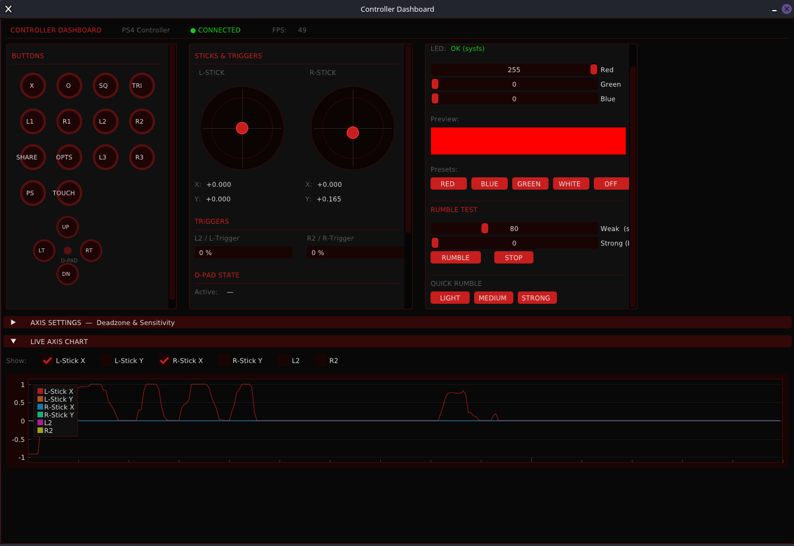
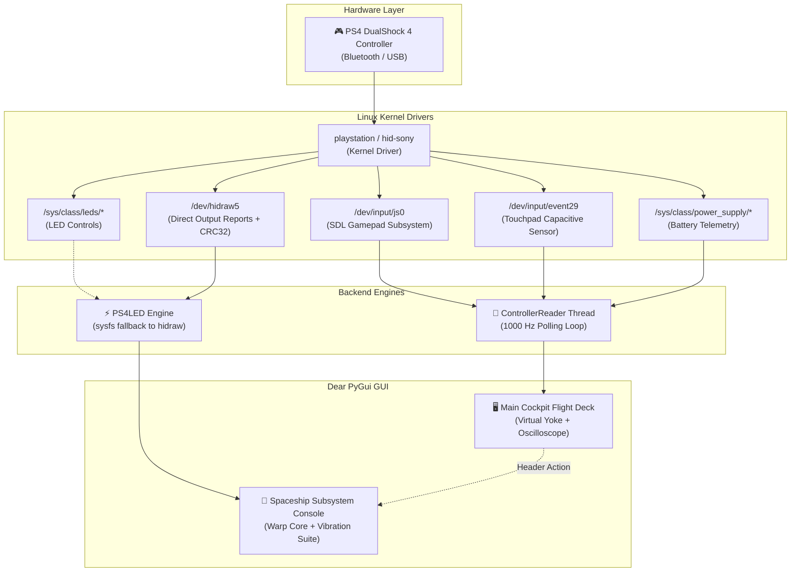

<div align="center">

```
  ██████╗ ██████╗ ███╗   ██╗████████╗██████╗  ██████╗ ██╗     ██╗     ███████╗██████╗ 
 ██╔════╝██╔═══██╗████╗  ██║╚══██╔══╝██╔══██╗██╔═══██╗██║     ██║     ██╔════╝██╔══██╗
 ██║     ██║   ██║██╔██╗ ██║   ██║   ██████╔╝██║   ██║██║     ██║     █████╗  ██████╔╝
 ██║     ██║   ██║██║╚██╗██║   ██║   ██╔══██╗██║   ██║██║     ██║     ██╔══╝  ██╔══██╗
 ╚██████╗╚██████╔╝██║ ╚████║   ██║   ██║  ██║╚██████╔╝███████╗███████╗███████╗██║  ██║
  ╚═════╝ ╚═════╝ ╚═╝  ╚═══╝   ╚═╝   ╚═╝  ╚═╝ ╚═════╝ ╚══════╝╚══════╝╚══════╝╚═╝  ╚═╝
                    — S T A R S H I P   F L I G H T   D E C K —
```

# ⚡ CONTROLLER DASHBOARD ⚡
### *Next-Gen Starship Cockpit Telemetry & Hardware Control Matrix for PS4 DualShock 4 & Gamepads*

[](https://python.org)
[](https://github.com/hoffstadt/DearPyGui)
[](#performance)
[](#hardware-support)
[](#quick-start)
[](#cyberpunk-flight-deck)

<br/>



*Live Telemetry Cockpit — 2D Virtual Gamepad, Dual Stick Gimbal, Trigger Displacement Gauges & Real-time Live Oscilloscope*

---

</div>

## 🌌 Overview

**Controller Dashboard** is an ultra-low latency, cyberpunk-themed flight deck application designed for Linux. Built from the ground up on **Dear PyGui** with hardware-level **hidraw** and **Linux kernel `playstation` driver integration**, it turns your PS4 DualShock 4 (or any SDL controller) into an interactive starship cockpit console.

Whether tuning stick deadzones, hunting analog stick drift, putting haptic rumble motors through stress tests, or customizing your lightbar's warp core reactor, Controller Dashboard gives you instant visual feedback at **1000 Hz**.

---

## ⚡ Key Features at Warp Speed

### 🛸 1. Virtual Flight Yoke (2D Gamepad Blueprint)
- **100% Hardware-Accurate Mapping**: Every button physically maps to its verified Linux kernel index (`0:✕`, `1:○`, `2:□`, `3:△`, `4:Share`, `5:PS`, `6:Options`, `7:L3`, `8:R3`, `9:L1`, `10:R1`, `11:Touch`).
- **Tactical Diamond Array**: Face buttons light up bright red in physical geometric orientation.
- **Dynamic Trigger Displacement**: L2 & R2 triggers render as progressive vertical thrust gauges.
- **RCS Thruster D-Pad**: 4-way vector navigation cross with active directional indicators.
- **Gimbal Stick Reticles**: Dual 2D stick visualizers featuring interactive center markers, azimuth tracking, and dedicated L3/R3 click glow rings.

### ✨ 2. Capacitive Touchpad Illumination & Finger Tracking
- **DS4 v2 Lightbar Slit**: Illuminated glowing neon light strip mounted across the top edge of the virtual touchpad (`vc_touch_light`).
- **Capacitive Contact Sensor**: Reads the Linux kernel's dedicated touchpad input node (`/dev/input/event*`) with sub-millisecond non-blocking I/O.
- **Live Finger Reticle**: A glowing interactive tracking dot follows your finger across the touchpad surface the instant you make contact.

### 🚀 3. Spaceship Subsystem & Haptics Matrix (`led.py`)
Launchable directly or through the main flight deck via `[ 💡 LED & RUMBLE CONTROLS ]`:
- **Warp Core Reactor Chamber**:
  - Calibrated Ion Red, Plasma Green, and Hyper Blue emission sliders.
  - Interactive visual containment chamber with real-time `#HEX` and spectrum telemetry.
  - 7 Instant Presets: `[ RED ALERT ]`, `[ PLASMA BLUE ]`, `[ WARP GREEN ]`, `[ SOLAR FLARE ]`, `[ CYBER VOID ]`, `[ HYPER WHITE ]`, and `[ CLOAKING (OFF) ]`.
  - **Stasis Pulse Mode**: Smooth sine-wave breathing reactor animation running on an asynchronous background thread.
- **Flight Propulsion Vibration Suite**:
  - Manual dual-motor thrusters with live load percentage bars (Stabilizer Gyros / Weak motor & Sublight Engines / Strong motor).
  - **5 Automated Vibration Diagnostic Profiles**:
    - `[ WARP PULSE ]` — 180ms high-frequency snap test.
    - `[ ENGINE RUMBLE ]` — 1.2s sustained deep sublight engine burn.
    - `[ HYPERDRIVE SPOOL ]` — Progressive 0% to 100% frequency ramping sweep.
    - `[ SHIELD BREACH ]` — Staggered triple kinetic impact shockwaves.
    - `[ FULL THRUST OVERLOAD ]` — Max dual-motor burst with auto-safety cutoff.
    - `[ EMERGENCY CUTOFF ]` — Instant kill switch for all haptics.

### ⚡ 4. 1000 Hz Sub-Millisecond Polling Engine
- Background daemon thread polling SDL inputs at **1000 Hz (1ms delay)**.
- Thread-safe state synchronizer protected by lightweight threading locks.
- Render loop locked to VSync (60+ FPS) without blocking or slowing controller polling.

### 🔋 5. Live Starship Power Cell / Battery Monitor
- Real-time battery capacity reading (`%`) and charging state (`Discharging` / `Charging` / `Full`) queried directly from kernel power supplies (`/sys/class/power_supply/`).
- On-demand **Refresh** button for zero background overhead.

### 📈 6. Real-Time Telemetry Oscilloscope
- Multi-channel scrolling live waveform plotter with 300-sample history (~5 seconds).
- Per-channel toggles for all 6 axes with distinct neon telemetry colors.
- Integrated deadzone (`0.0 - 0.50`) and sensitivity (`0.10 - 3.00`) sliders per axis.

---

## 🚀 Quick Start

### 1. Installation (Fast One-Shot)
The provided installer skips packages you already have and sets up necessary udev rules:

```bash
cd ~/controller-dashboard
bash install.sh
```

### 2. Launching the Flight Deck
Launch the full primary dashboard:

```bash
cd ~/controller-dashboard
./start.sh
# or: python3 main.py
```

### 3. Launching Standalone Subsystem Console
Run only the Warp Core Reactor & Vibration Testing suite:

```bash
cd ~/controller-dashboard
python3 led.py
```

---

## 🛠️ System Architecture



---

## 🗂️ Project Structure

```
controller-dashboard/
├── main.py               # Main cockpit flight deck UI & render loop
├── led.py                # Standalone Spaceship Subsystem launcher
├── led_ui.py             # Warp Core Reactor & Haptics Matrix window module
├── controller_reader.py  # 1000 Hz threaded input & touchpad reader
├── ps4_led.py            # Hardware lightbar & rumble driver (hidraw/sysfs)
├── theme.py              # Cyberpunk crimson & carbon Dear PyGui theme
├── install.sh            # One-shot Debian/Kali package & udev installer
├── start.sh              # Quick launch wrapper
├── requirements.txt      # Python dependencies
└── assets/
    └── dashboard_preview.png  # High-res live product showcase screenshot
```

---

## 🎮 Hardware Compatibility

| Controller | Input Detection | Sticks & Triggers | Lightbar RGB | Rumble Motors | Touchpad Tracking |
| :--- | :---: | :---: | :---: | :---: | :---: |
| **Sony DualShock 4 v2** | ✅ Full | ✅ Full | ✅ Full | ✅ Full | ✅ Full |
| **Sony DualShock 4 v1** | ✅ Full | ✅ Full | ✅ Full | ✅ Full | ✅ Full |
| **Xbox One / Series X** | ✅ Full | ✅ Full | N/A | ✅ (via SDL) | N/A |
| **Nintendo Switch Pro** | ✅ Full | ✅ Full | N/A | ✅ (via SDL) | N/A |
| **Generic SDL Gamepad** | ✅ Full | ✅ Full | N/A | ✅ (via SDL) | N/A |

---

<div align="center">

Made with ❤️ and extreme precision for Linux gamers and flight deck enthusiasts.

</div>
